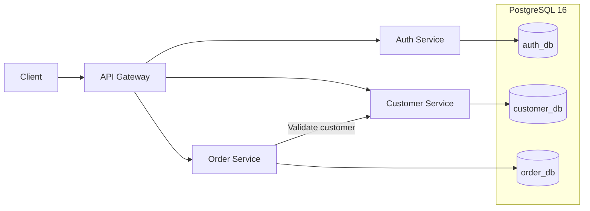

# Java Microservices Cloud Platform

Production-style backend platform built with **Java 17**, **Spring Boot**, **Spring Security**, **JWT**, **PostgreSQL**, **Docker**, and **GitHub Actions**.

This project demonstrates how a small microservices system can be designed, secured, tested, containerized, and prepared for Kubernetes and Azure deployment.

## Highlights

- Four independently deployable Spring Boot services
- API Gateway as the single local entry point
- Stateless authentication with RSA-signed JWTs
- BCrypt password hashing
- PostgreSQL with isolated application databases and roles
- Flyway-managed database migrations
- Docker Compose orchestration with health checks and resource limits
- End-to-end HTTP smoke testing against the complete stack
- GitHub Actions CI pipeline for tests, integration checks, container builds, and GHCR publishing
- Request correlation with `X-Request-ID`
- Liveness and readiness endpoints with Spring Boot Actuator
- Non-root application containers with Linux capabilities dropped

## Architecture



The gateway exposes the platform locally on `http://localhost:8088`. Application services and PostgreSQL remain internal to the Docker network.

## Services

| Service | Responsibility |
|---|---|
| `api-gateway` | Spring Cloud Gateway routing, request correlation, timeouts, health endpoint |
| `auth-service` | Account bootstrap, BCrypt password verification, RSA-signed JWT issuance |
| `customer-service` | Customer REST API, validation, persistence and pagination |
| `order-service` | Order REST API, customer validation through service-to-service HTTP, persistence |

## Tech Stack

**Backend**

- Java 17
- Spring Boot 3.5
- Spring Cloud Gateway
- Spring Security / OAuth2 Resource Server
- Spring Data JPA / Hibernate
- Flyway
- Maven

**Data & Infrastructure**

- PostgreSQL 16
- Docker
- Docker Compose
- GitHub Actions
- GitHub Container Registry

**Testing & Operations**

- JUnit
- H2 in PostgreSQL compatibility mode for selected tests
- Real PostgreSQL integration flow through Docker Compose
- Python standard-library smoke test
- Spring Boot Actuator
- Structured request correlation

## Security Design

Authentication is handled by `auth-service`.

- Passwords are stored as BCrypt hashes.
- Access tokens are signed with RSA using RS256.
- Resource services validate the token signature, issuer, audience, expiration, and required `lab` scope.
- The private RSA key is mounted only into the authentication service.
- Local secrets and generated credentials live in `.env` and `.secrets/`, both excluded from Git.
- Database application users are separated by service.
- Only the API Gateway publishes a host port in the default local configuration.

This repository intentionally contains no real credentials, private keys, or production secrets.

## API Flow

A typical authenticated flow is:

1. Authenticate with `POST /api/auth/login`.
2. Receive a short-lived Bearer token.
3. Create or query customers through the gateway.
4. Create an order using a valid `customerId`.
5. `order-service` validates the customer through `customer-service` before persisting the order.

The platform deliberately avoids a cross-service database foreign key and does not open a database transaction while waiting on remote HTTP I/O.

## Testing

The Java test suite currently contains **21 automated tests** covering:

- Gateway routing
- Authentication and JWT behavior
- Customer API behavior and persistence
- Order API behavior and persistence
- Service-to-service customer validation
- Error handling for remote failures
- Flyway migrations in the test environment

Run the Java test suite with:

```bash
mvn -B -ntp verify
```

The repository also includes an end-to-end smoke test that exercises the running Docker stack with real PostgreSQL, authentication, customer creation, and order creation:

```bash
python3 scripts/smoke-test.py
```

See `docs/VALIDATION.md` for the recorded validation scope.

## CI/CD

The GitHub Actions workflow in `.github/workflows/ci.yml` performs the following pipeline:

```text
Maven verify
    ↓
Build and start complete Docker Compose stack
    ↓
Run end-to-end smoke test
    ↓
Build service container images
    ↓
Publish images to GHCR on push/tag
```

Container images are built independently for:

- `api-gateway`
- `auth-service`
- `customer-service`
- `order-service`

Release tags follow the `v*` convention.

## Quick Start

### Prerequisites

- Docker Engine
- Docker Compose v2
- OpenSSL
- Python 3
- curl

Java and Maven are not required when the platform is started only through Docker Compose.

### 1. Clone the repository

```bash
git clone https://github.com/Castrese991/devops-azure-lab.git
cd devops-azure-lab
```

### 2. Generate local credentials and RSA keys

```bash
bash scripts/init-local.sh
```

The script creates local-only `.env` and `.secrets/` files.

### 3. Start the complete stack

```bash
docker compose up -d --build --wait --wait-timeout 240
```

### 4. Run the end-to-end smoke test

```bash
python3 scripts/smoke-test.py
```

### 5. Inspect the platform

```bash
docker compose ps
curl -i http://localhost:8088/actuator/health/readiness
docker compose logs --tail=100 order-service
```

### 6. Stop the environment

```bash
docker compose stop
```

Use `docker compose down` when you want to remove containers while keeping the PostgreSQL volume.

> `docker compose down -v` deletes the local database volume and all laboratory data.

## Observability

Each application exposes:

- `/actuator/health/liveness`
- `/actuator/health/readiness`

Request logs include:

- request ID
- HTTP method
- path
- response status
- request duration

Sensitive request bodies and Bearer tokens are not intentionally logged.

`order-service` propagates `X-Request-ID` to `customer-service`, making it possible to correlate the cross-service request path in logs.

## Repository Structure

```text
.
├── api-gateway/
├── auth-service/
├── customer-service/
├── order-service/
├── infra/
│   └── postgres/
├── scripts/
├── docs/
├── compose.yaml
├── compose.ghcr.yaml
├── pom.xml
└── .github/workflows/ci.yml
```

## Current Status

### Implemented

- Java/Spring Boot microservices
- REST APIs
- Spring Security
- RSA JWT authentication
- PostgreSQL
- Flyway migrations
- Docker / Docker Compose
- Health checks
- End-to-end smoke testing
- GitHub Actions CI
- GHCR image build/publishing workflow

### In progress / planned

- Local Kubernetes deployment
- Azure Container Registry
- Azure Kubernetes Service
- Azure Monitor
- Log Analytics
- Application Insights
- TLS and DNS
- Managed secrets
- Production-grade alerting and distributed tracing

Kubernetes and Azure are intentionally listed as roadmap items until the corresponding deployment is implemented and verified.

## Engineering Decisions

A few design choices are intentional:

- Each service owns its persistence boundary.
- Database credentials are separated by service.
- The gateway is not treated as the only security boundary; downstream services validate JWTs independently.
- Liveness is kept independent from database availability to avoid unnecessary restart loops.
- `order-service` does not automatically retry POST operations.
- Remote customer validation happens before order persistence.
- The local setup favors reproducibility and troubleshooting over production infrastructure complexity.

## Documentation

Additional documentation is available under `docs/`:

- `01-FILE-GUIDE.md` — codebase walkthrough
- `02-API.md` — API examples
- `03-ROADMAP.md` — local → Kubernetes → Azure roadmap
- `04-INCIDENT-PROTOCOL.md` — troubleshooting practice protocol
- `05-LOCAL-OPERATIONS.md` — local operations runbook
- `VALIDATION.md` — verified test scope

---

### Project purpose

This is a personal engineering project built to demonstrate practical backend, microservices, containerization, CI/CD, security, and cloud-readiness skills with a reproducible codebase rather than a purely theoretical example.
